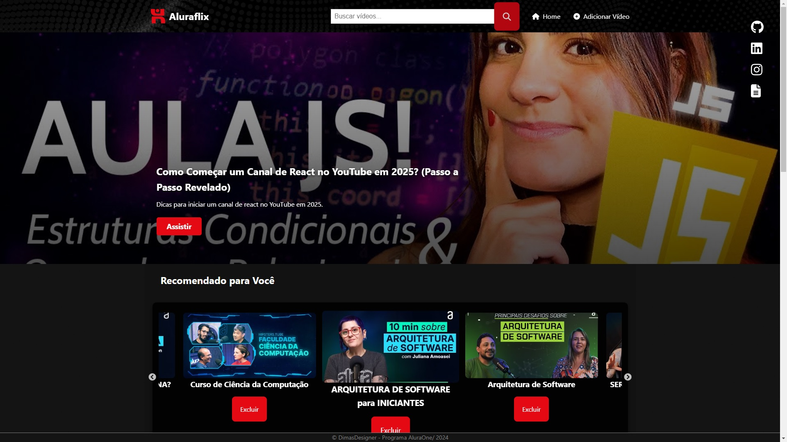

# AluraFlix

Bem-vindo ao **AluraFlix**, uma plataforma inspirada nos serviços de streaming, desenvolvida com React! Este projeto é parte do curso Alura One, com o objetivo de criar uma aplicação funcional para organizar e assistir vídeos.



---

## Funcionalidades

- Adicionar vídeos à lista.
- Excluir vídeos.
- Curtir e selecionar vídeos favoritos.
- Layout responsivo para desktop e dispositivos móveis.

---

## Tecnologias Utilizadas

- **React.js**: Biblioteca principal para a construção da interface.
- **CSS**: Estilização personalizada para o design.
- **Create React App**: Ferramenta utilizada para inicializar o projeto.
- **Vercel**: Plataforma para deploy do projeto.

---

## Como Rodar o Projeto Localmente

Siga os passos abaixo para executar o projeto no seu computador:

1. Clone o repositório:
   ```bash
   git clone https://github.com/dimaswebdev/AluraFlix.git

2. Navegue até o diretório do projeto:
   cd AluraFlix

3. Instale as dependências:
   ```bash
   npm install

4. Inicie o projeto:
   ```bash
   npm start


5. O projeto estará disponível em http://localhost:3000.

6. Contribuição:
   Contribuições são bem-vindas! Sinta-se à vontade para abrir uma issue ou enviar um pull request.

7. Licença
   Este projeto está licenciado sob a licença MIT. Veja o arquivo LICENSE para mais detalhes.